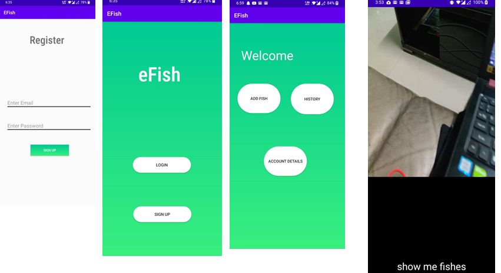

# efish is an online platform for fisherman to sell fishes and it has image classification of fish powered by TensorFlow to identify the fish is endangered species or not. efish goal is to increase the population of the fish species and prevent extinction.

